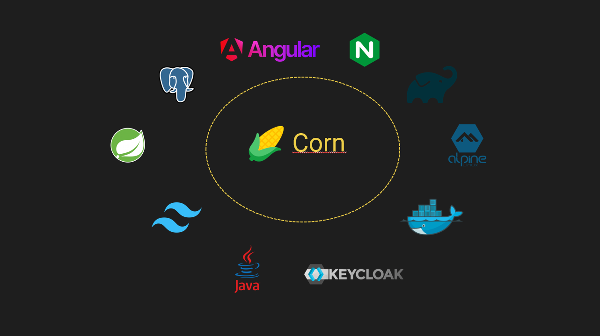
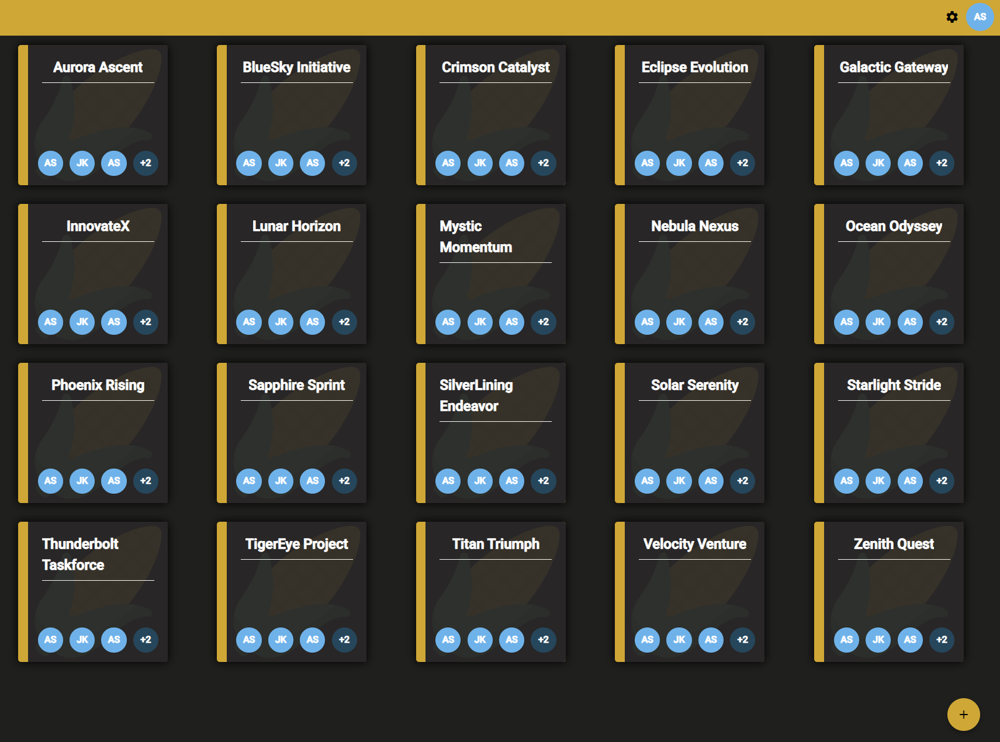
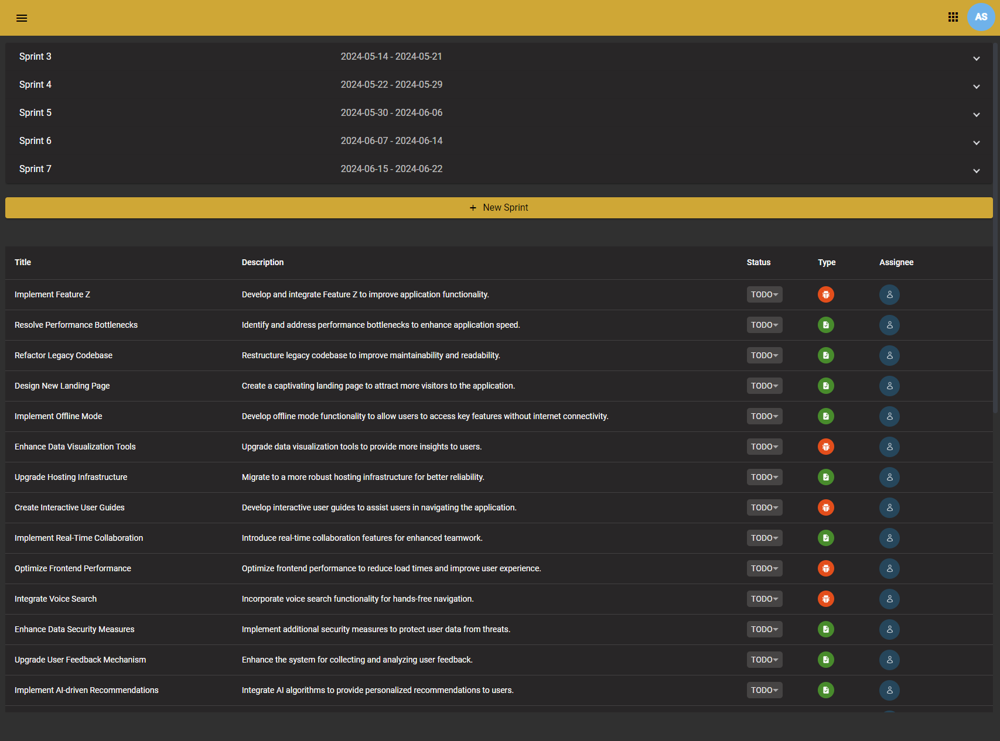
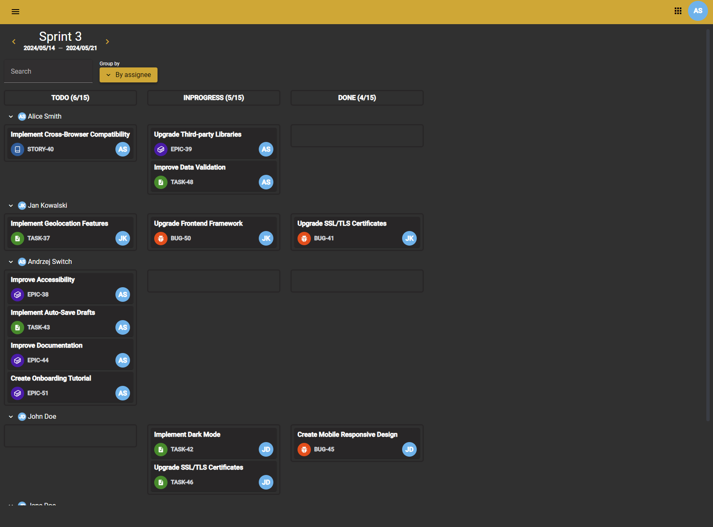

# Corn

Team project with aim to create an open source developer collaboration platform for small teams. We are creating
application that is built of few components.

* Frontend client,
* Backend server,
* Keycloak Auth Server,
* Nginx Reverse Proxy,
* Postgres database.

Whole application has been made in spirit of clean code and architecture. We are thinking about security and performance
best practices. Project is deeply tested on backend site and uses Github Actions for CI/CD.

## Database diagram

<div align="center">
    
</div>

## How to run

Application uses docker compose technology to run all components. To run application you have to install docker.

We have to different ways to start application.

1. Using docker compose command directly

* Clone repository 
* Go to root directory
* If you want development environment run 

```bash 
docker compose -f docker-compose.dev.yml up --build
```

* If you want production environment run

```bash
docker compose -f docker-compose.prod.yml up --build
```

2. Using scripts. We provided linux shell scripts that are able to run application in development and production mode. Just pick the right one and run it.
For example if you want to run application in development mode run:

```bash
cd scripts/dev

./run.dev.sh
```

## Tech stack

<div align="center">
    
</div>

1. Frontend

* Angular 17,
* Angular Material,
* Angular PWA,
* Keycloak Service,
* Nginx,
* NgIcons,
* TypeScript,
* Docker,
* Tailwind CSS,
* Scss

2. Backend

* Java 17,
* Spring Boot 3.1.5,
* Spring Data Jpa,
* Spring Security,
* Spring Boot Validation,
* Hibernate,
* Postgres,
* OAuth2 Resource Server,
* Mockito,
* JUnit,
* H2 Database,
* KeyCloak,
* Mapstruct,
* Lombok.

## Screenshots

* Login

<div align="center">
    
</div>

* Register

<div align="center">
    
</div>

* Projects

<div align="center">
    
</div>

* Project settings

<div align="center">
    
</div>

* Sprints

<div align="center">
    
</div>

* Sprints Burndown

<div align="center">
    
</div>

* Task

<div align="center">
    
</div>

* Task Comments

<div align="center">
    
</div>

* Creating new backlog item

<div align="center">
    
</div>

* Tasks in Boards

<div align="center">
    
</div>

* Tasks grouped by member

<div align="center">
    
</div>
